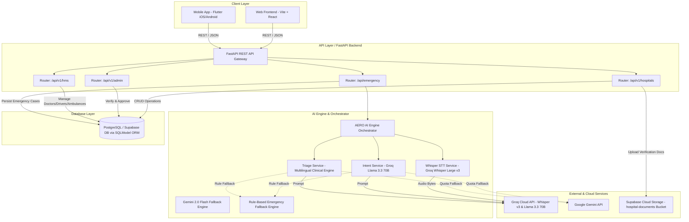
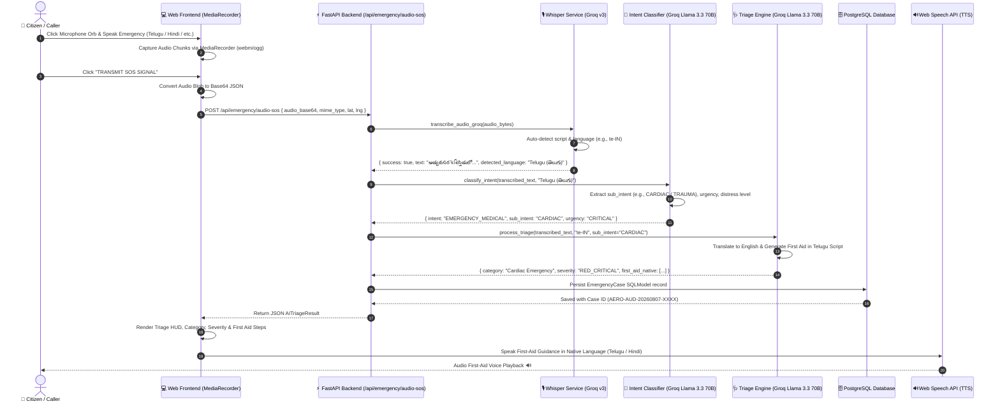
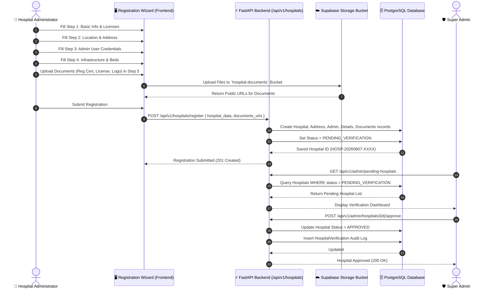
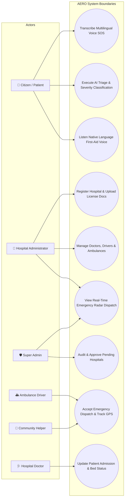
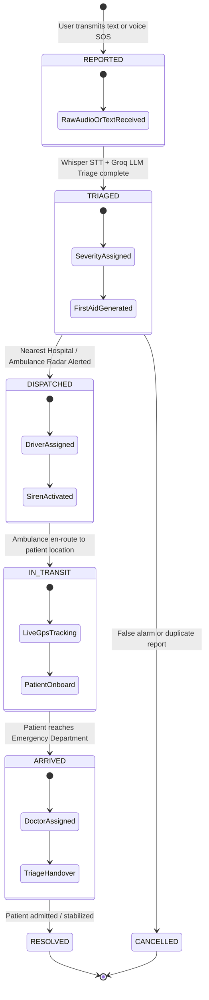
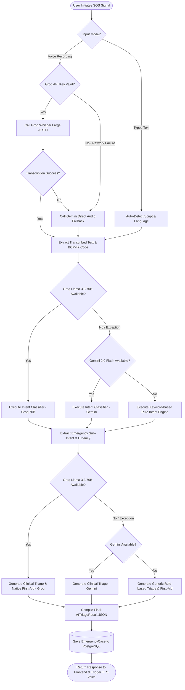

# Sanjeevani (AERO) — Unified UML Diagrams & System Architecture

This document provides a complete set of **UML diagrams** (Mermaid format) representing the software architecture, data models, sequence flows, use cases, state transitions, and activity logic of the **Sanjeevani AI Emergency Response Orchestrator (AERO)** system.

---

## Table of Contents
1. [System Architecture & Component Diagram](#1-system-architecture--component-diagram)
2. [Class & Entity Relationship (ER) Diagram](#2-class--entity-relationship-er-diagram)
3. [Sequence Diagram: Multilingual SOS Voice Intake & Triage](#3-sequence-diagram-multilingual-sos-voice-intake--triage)
4. [Sequence Diagram: Hospital Registration & Admin Approval](#4-sequence-diagram-hospital-registration--admin-approval)
5. [Use Case Diagram](#5-use-case-diagram)
6. [State Machine Diagram: Emergency Case Lifecycle](#6-state-machine-diagram-emergency-case-lifecycle)
7. [Activity Diagram: STT, Intent & Triage Fallback Pipeline](#7-activity-diagram-stt-intent--triage-fallback-pipeline)

---

## 1. System Architecture & Component Diagram

High-level system topology showing client applications, API Gateway (FastAPI), AI Engine, Storage, and Database layer.

---

## 2. Class & Entity Relationship (ER) Diagram

Represents the **SQLModel ORM** entity schemas and database relationships across the system.

```mermaid
classDiagram
    %% Core Users & Emergency System
    class User {
        +String id (PK)
        +String name
        +String phone
        +String email
        +RoleEnum role
        +String language
        +String blood_group
        +String emergency_contact
        +DateTime created_at
    }

    class EmergencyCase {
        +String id (PK)
        +String input_text
        +String detected_language
        +String language_code
        +String translated_english
        +String category
        +SeverityEnum severity
        +String triage_code
        +String chief_complaint
        +List~String~ symptoms
        +String recommended_doctor_specialty
        +String triage_summary
        +List~JSON~ first_aid_english
        +List~JSON~ first_aid_native
        +Float patient_lat
        +Float patient_lng
        +EmergencyStatusEnum status
        +DateTime created_at
    }

    class IncidentRecord {
        +String id (PK)
        +String emergency_case_id (FK)
        +String action
        +String details
        +DateTime timestamp
    }

    class CommunityWorker {
        +String id (PK)
        +String user_id (FK)
        +String skills
        +Float current_lat
        +Float current_lng
        +Boolean is_available
    }

    %% Hospital Enterprise System
    class Hospital {
        +String id (PK)
        +String name
        +HospitalTypeEnum hospital_type
        +HospitalCategoryEnum category
        +String registration_number
        +String license_number
        +Boolean has_nabh_accreditation
        +String nabh_number
        +String gst_number
        +VerificationStatusEnum status
        +DateTime created_at
        +DateTime updated_at
    }

    class HospitalAddress {
        +String id (PK)
        +String hospital_id (FK)
        +String country
        +String state
        +String district
        +String city
        +String area
        +String pincode
        +String complete_address
        +Float latitude
        +Float longitude
    }

    class HospitalAdministrator {
        +String id (PK)
        +String hospital_id (FK)
        +String name
        +String designation
        +String email
        +String mobile
        +String password_hash
        +Boolean is_active
        +String role
    }

    class HospitalDetails {
        +String id (PK)
        +String hospital_id (FK)
        +Integer total_beds
        +Integer icu_beds
        +Boolean has_emergency_dept
        +Boolean has_trauma_center
        +Boolean has_blood_bank
        +Integer ambulance_count
        +List~String~ departments
        +List~String~ specializations
    }

    class HospitalDocuments {
        +String id (PK)
        +String hospital_id (FK)
        +String registration_cert_url
        +String govt_license_url
        +String nabh_cert_url
        +String pan_url
        +String gst_url
        +String exterior_image_url
        +String logo_url
    }

    class HospitalIntegration {
        +String id (PK)
        +String hospital_id (FK)
        +IntegrationModeEnum integration_mode
        +String base_url
        +String callback_url
        +String api_doc_url
        +String tech_contact_name
        +String tech_contact_email
    }

    class HospitalVerification {
        +String id (PK)
        +String hospital_id (FK)
        +VerificationStatusEnum verification_status
        +String reviewed_by
        +String review_notes
        +DateTime verified_at
    }

    %% Hospital Management System (HMS) Sub-entities
    class Doctor {
        +String id (PK)
        +String hospital_id (FK)
        +String name
        +String specialization
        +String contact_number
        +String email
        +String status
        +String shift_timing
        +String password_hash
        +Boolean is_active
    }

    class Driver {
        +String id (PK)
        +String hospital_id (FK)
        +String name
        +String contact_number
        +String license_number
        +String email
        +String password_hash
        +String status
        +String shift_timing
    }

    class Ambulance {
        +String id (PK)
        +String hospital_id (FK)
        +String vehicle_registration
        +String vehicle_type
        +String assigned_driver_id (FK)
        +String assigned_driver_name
        +String status
        +Float current_lat
        +Float current_lng
    }

    %% Relationships
    User "1" -- "0..1" CommunityWorker : owns
    EmergencyCase "1" -- "0..*" IncidentRecord : tracks
    Hospital "1" -- "1" HospitalAddress : located_at
    Hospital "1" -- "1" HospitalAdministrator : managed_by
    Hospital "1" -- "1" HospitalDetails : configured_with
    Hospital "1" -- "1" HospitalDocuments : verified_via
    Hospital "1" -- "1" HospitalIntegration : integrates_with
    Hospital "1" -- "0..*" HospitalVerification : audited_by
    Hospital "1" -- "0..*" Doctor : employs
    Hospital "1" -- "0..*" Driver : employs
    Hospital "1" -- "0..*" Ambulance : owns
    Driver "1" -- "0..1" Ambulance : drives
```

---

## 3. Sequence Diagram: Multilingual SOS Voice Intake & Triage

Flow of user voice audio from frontend through STT, Intent Classification, Triage Engine, Database Persistence, and TTS Voice Output.

---

## 4. Sequence Diagram: Hospital Registration & Admin Approval

Workflow for hospital registration wizard, document upload to Supabase, and Super Admin approval.

---

## 5. Use Case Diagram

Identifies all actors and primary system interactions across Citizen Intake, Emergency Orchestration, Hospital Operations, and Super Administration.

---

## 6. State Machine Diagram: Emergency Case Lifecycle

States and transition triggers for an emergency case from initial SOS intake through triage, dispatch, transit, and resolution.

---

## 7. Activity Diagram: STT, Intent & Triage Fallback Pipeline

Multi-tier execution and fault-tolerant fallback strategy for Speech-To-Text, Intent Classification, and Clinical Triage.

---

*Generated for Sanjeevani (AERO) Repository — Pure Python SQLModel + FastAPI + Groq Whisper v3 + Groq Llama 3.3 70B.*
